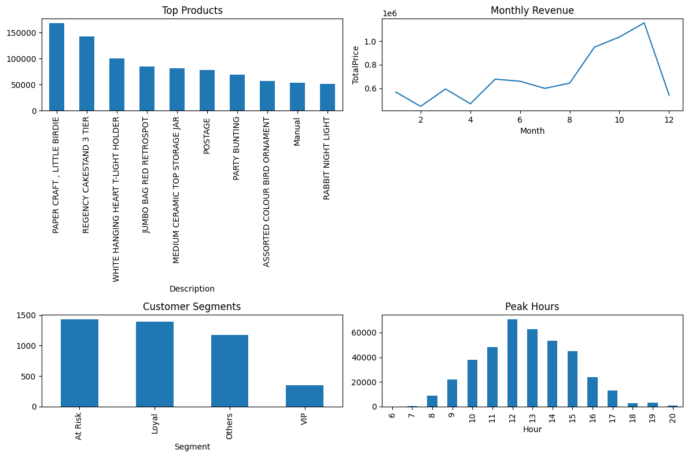
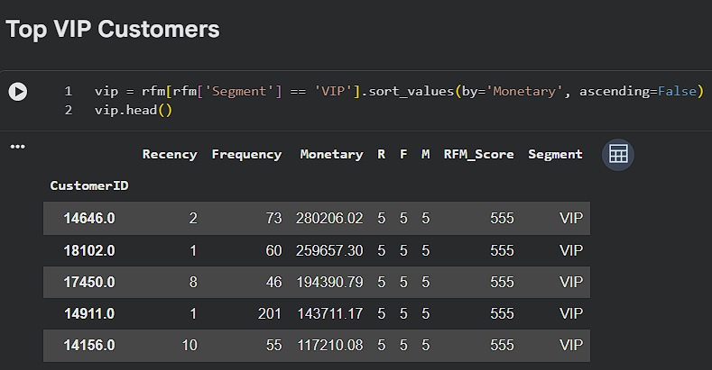

# 🛒 E-Commerce Business Intelligence & Customer Analytics

## 📌 Project Overview

This project focuses on analyzing e-commerce customer behavior and sales performance using Data Analytics and Business Intelligence techniques. The objective is to transform raw transactional data into actionable business insights that help improve customer retention, increase revenue, and support data-driven decision-making.

The project was developed as part of a Python Data Analytics with AI Internship and demonstrates a complete analytics workflow from data acquisition and preprocessing to customer segmentation, dashboard reporting, and strategic business recommendations.

---

## 🎯 Project Objectives

The primary objectives of this project were to:

* Analyze customer purchasing behavior using transactional data.
* Identify high-value, loyal, and at-risk customers.
* Discover revenue trends and peak shopping periods.
* Evaluate product performance and sales patterns.
* Generate business intelligence insights for strategic decision-making.
* Build an executive dashboard for stakeholders.
* Provide data-driven recommendations to improve business performance.

---

## 🎯 Business Problem

The e-commerce business experiences high website traffic but faces challenges in:

* Converting visitors into high-value customers.
* Improving customer retention.
* Identifying profitable customer segments.
* Understanding sales trends and customer behavior.
* Maximizing overall revenue growth.

This project addresses these challenges through customer analytics and business intelligence techniques.

---

## 📊 Dataset

**Dataset Used:** UCI Online Retail Dataset

The dataset contains transactional records including:

* Invoice Information
* Product Details
* Customer Information
* Purchase Quantity
* Unit Price
* Transaction Date
* Country

---

## 🛠️ Technologies & Tools

### Programming Language

* Python

### Libraries

* Pandas
* NumPy
* Matplotlib
* Seaborn
* SQLite3

### Development Environment

* Google Colab
* Jupyter Notebook

### Analytics Techniques

* Data Cleaning
* Data Preprocessing
* Feature Engineering
* Exploratory Data Analysis (EDA)
* RFM Customer Segmentation
* Business Intelligence Reporting
* Dashboard Development

---

## ⚙️ Project Workflow

### 1️⃣ Data Acquisition & Cleaning

* Loaded transactional retail dataset.
* Inspected dataset structure and quality.
* Removed missing Customer IDs.
* Removed duplicate records.
* Filtered invalid transactions.
* Handled missing values.
* Removed cancelled orders.

### 2️⃣ Feature Engineering

Created additional business metrics:

* Total Revenue
* Purchase Year
* Purchase Month
* Purchase Day
* Purchase Hour

### 3️⃣ Exploratory Data Analysis (EDA)

Performed detailed analysis on:

* Monthly Revenue Trends
* Peak Shopping Hours
* Product Performance
* Customer Purchase Behavior
* Revenue Distribution by Country
* Average Order Value (AOV)

### 4️⃣ Customer Segmentation (RFM Analysis)

Customers were segmented using:

#### Recency (R)

How recently a customer made a purchase.

#### Frequency (F)

How often a customer makes purchases.

#### Monetary (M)

How much revenue a customer generates.

Customer categories identified:

* ⭐ VIP Customers
* 🤝 Loyal Customers
* ⚠️ At-Risk Customers
* 📦 Other Customers

This segmentation helps businesses develop targeted retention and marketing strategies.

### 5️⃣ Business Insights & Recommendations

Generated strategic recommendations for:

* Customer Retention
* Revenue Optimization
* Marketing Campaign Planning
* Loyalty Program Development
* Customer Re-engagement Strategies

### 6️⃣ Executive Dashboard

Built an executive dashboard combining:

* Top Revenue-Generating Products
* Monthly Revenue Trends
* Customer Segmentation Overview
* Peak Shopping Hours

The dashboard provides a concise business intelligence view for business stakeholders and decision-makers.

---

## 📈 Key Findings

### 💰 Revenue Analysis

* Revenue demonstrates clear seasonal trends.
* Peak revenue was observed during high-demand months.
* Revenue growth is influenced by a small number of high-performing products.

### 👥 Customer Analysis

* VIP customers contribute a significant share of total revenue.
* Loyal customers represent strong long-term business value.
* At-risk customers provide opportunities for retention campaigns.

### 🛍️ Product Analysis

* Top-selling products contribute the majority of overall revenue.
* Product performance varies significantly across categories.

### ⏰ Shopping Behavior Analysis

* Customer activity peaks during specific shopping hours.
* Marketing campaigns can be optimized around high-engagement periods.

---

## 📊 Executive Dashboard

The dashboard provides a consolidated view of:

* Top Products by Revenue
* Monthly Revenue Trends
* Customer Segmentation Distribution
* Peak Shopping Hours

### Dashboard Preview



---

## 👑 VIP Customer Analysis

The project identifies high-value customers using RFM scoring techniques.

### VIP Customer Preview



---

## 🏆 Business Impact

This project demonstrates how Data Analytics can be used to:

* Improve customer retention.
* Increase Average Order Value (AOV).
* Identify high-value customer segments.
* Optimize marketing strategies.
* Support revenue growth initiatives.
* Enable data-driven business decisions.

---

## 📚 Skills Demonstrated

* Data Analytics
* Business Intelligence
* Customer Segmentation
* RFM Analysis
* Data Visualization
* Exploratory Data Analysis (EDA)
* Data Cleaning
* Data Preprocessing
* Feature Engineering
* SQL Database Operations
* Business Reporting
* Dashboard Development
* Strategic Recommendation Development

---

## 📂 Project Structure

```text
E-Commerce-Business-Intelligence-Customer-Analytics
│
├── Notebooks
│   └── E_Commerce_Business_Intelligence_Customer_Analytics.ipynb
│
├── Outputs
│   └── rfm_data.csv
│
├── Screenshots
│   ├── executive_dashboard.png
│   └── vip_customers.png
│
├── README.md
└── requirements.txt
```

---

## 🚀 Future Enhancements

* Customer Churn Prediction
* Sales Forecasting Models
* Interactive Power BI Dashboard
* Streamlit Web Application
* Machine Learning-Based Customer Segmentation
* Real-Time Analytics Dashboard
* Customer Recommendation System

---

## 👨‍💻 Author

**Bandarupalli Chandra Sheshank**

BCA (Computer Science)

Aspiring Data Analyst | Business Intelligence Enthusiast | Future AI & ML Professional

---

### Internship Project

**Python Data Analytics with AI Internship**

VIHAN IT PROFESSIONALS
